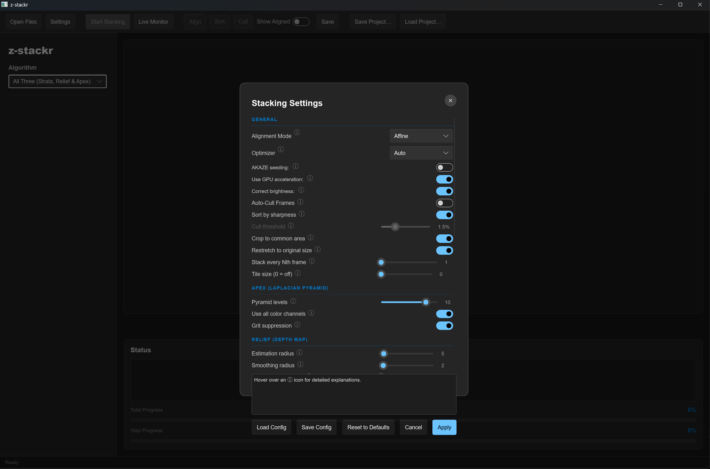

# z-stackr




**z-stackr** is a high-performance, professional-grade focus stacking application written entirely in Rust. It takes a sequence of macro or micro images captured at varying focus depths and seamlessly blends them into a single, completely sharp composite image.

Whether you are shooting extreme macro photography, focus-bracketed landscapes, or scientific microscopy, z-stackr provides physically accurate, linear-light blending powered by advanced computer vision algorithms and an out-of-core architecture designed to handle massive image sets with minimal memory overhead.

---

## 🌟 Key Features

* **Advanced Alignment Engine**: A coarse-to-fine subpixel alignment engine (multi-scale Gaussian pyramid, always-bounded logit-space search, a finest-level schedule that's deliberately under-refined to avoid chasing sensor noise, and a post-refinement gate that falls back to identity whenever refinement scores worse than doing nothing) driven by a selectable `optimizer`: `auto` (default) tries a pyramid Lucas-Kanade / Gauss-Newton optimiser (analytic image-gradient Jacobians, far fewer iterations than blind function sampling) first and falls back to the original Nelder-Mead bounded simplex (coarsest-level random restarts) on failure or RMS regression; `lucaskanade`/`neldermead` force one optimiser unconditionally. Every classical mode (`affine`, `translation`, `registration`, `none`) shares whichever optimiser is selected, differing only in which degrees of freedom are solved — a strict ladder, `translation` ⊂ `registration` (default) ⊂ `affine`: `translation` solves shift **plus focus-breathing scale**, rotation held fixed; `registration` adds rotation (shift + uniform scale + rotation, a similarity transform); `affine` adds separate X/Y scale and shear on top of `registration` — a true 6-DOF affine solve; `none` skips refinement entirely. A fifth mode, `neural` (requires the `nn` feature, **experimental**), replaces this entirely with a trained alignment network — either the whole-stack `batchalign-v2` architecture (all matrices in one batched inference call) or the streaming pairwise `fusionalign-v1` architecture (one reference/frame pair per call, O(1) memory in stack size), selected automatically from the chosen model's manifest — see "Fusion Modes" and `crates/stacker-align/README.md` for the full contract. Warping is edge-clamped; by default (`crop_to_common_area = true`) the saved output is cropped to the largest rectangle covered by every aligned frame, removing the smeared edge-replication band that focus breathing leaves behind and excluding it from fusion processing — a rogue/misaligned frame that would shrink the crop below 25% of the canvas is ignored (falls back to full canvas, with a warning logged). Set `crop_to_common_area = false` to always save the full, uncropped canvas. Optionally, `resize_cropped_to_original` (default `false`) restretches that cropped result back up to the original canvas resolution with a high-quality edge-clamped resampler, instead of saving the smaller cropped size.
* **Optional AKAZE + RANSAC Seed**: Compile with the `akaze` feature to allow an optional feature-matching seed for the intensity optimiser — useful for heavily shifted, well-textured handheld shots. Seeding is **off by default and never required**: with it off (or on glossy / featureless subjects where feature detectors fail) registration is pure intensity-based.
* **Per-Frame Brightness Correction**: Per-frame brightness/gamma correction (on by default). After warping, each frame's luma is fit toward the first frame's target mean/std via a small 2-parameter `(scale, gamma)` solve, and the resulting ratio is applied to chroma too so hue is preserved — corrects for exposure/vignette drift between shots in a bracketed sequence without shifting colour.
* **Gamma-Space Processing**: The pipeline deliberately stores and blends **gamma-encoded (sRGB) values** end to end — a reference-fidelity choice that reproduces the established look of classic stacking tools. Loading normalises samples to `[0, 1]` with no transfer function; fusion, alignment metrics, and saving all operate on those gamma-encoded values. (The one exception is the neural mode: its network was trained on linearised data, so its bridge converts to linear RGB and back at the model boundary.)
* **SIMD Acceleration**: Hot paths — sRGB⇄linear colour conversion (lookup-table + SIMD), the separable pyramid blur, and the warp/bicubic resampler — use portable `std::simd`, lowering to AVX2 (zen3) or AVX-512 (zen4) and falling back to scalar on other targets.
* **Out-of-Core Tiled Architecture**: Processes images tile-by-tile so peak memory scales with the configured tile size rather than the full image resolution. Tiles are streamed to/from temporary files by a file-backed manager (`TileManager`) using plain blocking `std::fs`, with each planar channel read/written as a single bulk `bytemuck` byte copy (no per-element conversion). True `mmap(2)` is intentionally avoided: the access pattern is write-once/read-once and `PlanarImage` owns its buffers, so a memory map would still be copied into them — capturing essentially none of mmap's benefit.
* **Multiple Fusion Algorithms**: Choose between **Apex** (Laplacian Pyramid), **Relief** — with **two selectable engines**, a argmax + Guided Filter (default) and a confidence-weighted multigrid depth-solver —, **Strata** (guided-filter soft-blend: every frame contributes to every pixel, edge-aware weighted, for fewer halos at depth edges than a hard per-pixel/per-band pick), and a learned **AI Model** (neural) mode based on your specific subject requirements.
* **Neural "AI Model" Stacking**: A specialized, fully-convolutional pairwise-merge network (`FocusMergeNet`) on the [Burn](https://burn.dev/) framework that folds a focus stack into one all-in-focus result. It ships with `xs`–`xxl` capacity presets, tiled inference for arbitrarily large (8K+) images, CPU (`ndarray`) and optional GPU (`wgpu`/Vulkan) backends, and a from-scratch training binary with crash-safe checkpointing and resume. The entire feature is **opt-in behind the `nn` feature** — the applications build with **zero ML / Burn dependencies by default**.
* **Live Preview**: During alignment the canvas shows each frame as it is registered (the most-recently-aligned image) — both from the Align button and during the Stack pipeline's alignment stage. During Apex fusion the running composite refreshes on throttled checkpoints; during Relief fusion the per-frame focus-measure progress is reported and the raw depth-index map is shown before the solve; during AI stacking the running composite sharpens as each frame is folded in. A two-bar progress display shows monotonic total progress (load 0–15%, align 15–50%, fuse 50–95%, save 95–100%) plus per-step progress.
* **16-bit Support**: End-to-end 16-bit processing pipeline. Input files (TIFF/PNG) are read in 16-bit, processed in `f32`, and optionally written back out as 16-bit to preserve sub-8-bit precision.
* **EXIF Metadata Copy**: Optionally copies the raw EXIF blob from the first source frame into the output file (JPEG/PNG only) at the byte level — no pixel re-encode, no decoded-field reconstruction.
* **Optional Pure-Rust RAW Support** (`raw` feature): Stack camera RAW files directly — CR2, CR3, NEF, ARW, DNG, RAF, ORF, RW2, PEF and more (see "RAW Image Support" below) — decoded via the pure-Rust `rawler` crate, no C/C++ dependency and no change to the project's PGO/BOLT pure-Rust build chain. A per-run decode-once cache ensures each RAW frame is demosaiced exactly once even though the pipeline's alignment stages would otherwise reload it 2-3 times.
* **Python Bindings** (`z-stackr-python`, PyPI package `z-stackr`, import name `zstackr`): PyO3 bindings exposing both an out-of-core file API (`stack_files`, `batch_stack`) and an in-RAM numpy API (`stack_arrays`) for scripting, automation, and microscopy/lab pipelines — see `crates/stacker-python/README.md`.
* **Optional GPU Acceleration** (`gpu` feature, **experimental**): A `wgpu` compute-shader path covering every fusion engine and the alignment warp — tiled/batch Apex (Laplacian-pyramid) fusion, the GUI's in-RAM incremental Apex accumulator (GPU-resident across frames, read back once at the end), the production edge-clamped warp, Strata's per-frame saliency pass, and both of Relief's hot loops (the guided filter's box-filter pass and the Multigrid solver's relaxation sweep). When compiled in, each of these tries the GPU and transparently falls back to the existing CPU/SIMD implementation whenever no adapter is available or any GPU call fails — including, for the incremental accumulator, a graceful mid-stack hand-off that reads back the GPU-accumulated state and finishes the remaining frames on the CPU rather than reprocessing or restarting. **The CPU path remains the default and the reference implementation** — GPU output is tolerance-equal (not bit-equal) to it. Off by default; build with `--features gpu` to enable. A runtime toggle (`use_gpu` in the config TOML, a GUI switch, `--no-gpu` on the CLI, and `PyStackingSettings.use_gpu` in Python) lets you disable the GPU path at runtime even in a `gpu`-feature build, without recompiling. 

---

## 🛠️ Architecture

The project is structured as a Cargo workspace with distinct, modular components. (Package names are `z-stackr-*`; the in-code crate identifiers remain `stacker_core`, `stacker_algo`, etc.)

### Applications (`apps/`)
* **`z-stackr-cli`**: The high-performance command-line interface for batch processing and headless environments (binary: `z-stackr`).
* **`z-stackr-gui`**: A graphical user interface built with Slint for visual stacking (binary: `z-stackr-gui`).

### Crates (`crates/`)
* **`z-stackr-core`**: Core image representations (`PlanarImage`), linear/sRGB color space conversions, shared frame preprocessing (rotation/crop/resize), and the out-of-core tiled memory manager.
* **`z-stackr-align`**: Image alignment logic — the shared `pipeline::align_frame` dispatch (the single entry point both apps call), a coarse-to-fine subpixel refinement (selectable Lucas-Kanade / Gauss-Newton or Nelder-Mead optimiser, `auto` by default) with an *optional* AKAZE + RANSAC feature-matching seed, and per-frame brightness correction.
* **`z-stackr-algo`**: The classical fusion algorithms — Laplacian pyramids (Apex), Relief (with two selectable engines: Guided Filter, and a Multigrid depth-solver), and Strata (guided-filter soft-blend fusion).
* **`z-stackr-pipeline`**: The out-of-core, tiled `run_pipeline` engine — the single shared entry point both `z-stackr-cli` (always) and `z-stackr-gui` (when its `tile_size` setting is `> 0`) call, so the tiled processing path can never silently diverge between the two apps.
* **`z-stackr-nn`**: The neural engine on the Burn framework — four built-in architectures (`FocusMergeNet` pairwise fusion, `BatchMergeNet` batch fusion, `BatchAlignNet` whole-stack alignment, `FusionAlignNet` streaming pairwise alignment) with `xs`–`xxl` presets, the training losses, tiled inference, the planar↔tensor bridge, model discovery, runtime backend dispatch, and the `z-stackr-train` training binary.
* **`z-stackr-python`**: PyO3 Python bindings (crate identifier `stacker_python`, Python import name `zstackr`, PyPI package `z-stackr`) exposing both the out-of-core file pipeline (`stack_files`, `batch_stack`, `load_config`/`save_config`, `load_image`) and an in-RAM numpy API (`stack_arrays`) for scripting and automation — see `crates/stacker-python/README.md`.

> **AKAZE**: Coarse feature-based pre-alignment uses the upstream [`akaze`](https://crates.io/crates/akaze) crate (v0.7.0) from crates.io, gated behind the optional `akaze` feature.

---

## 🧩 Using the Crates as a Library

The `z-stackr-core`, `z-stackr-align`, `z-stackr-algo`, `z-stackr-pipeline`, and `z-stackr-nn` crates are ordinary library crates with no dependency on the CLI or GUI — each is usable standalone in your own Rust project (e.g. a custom batch pipeline, a different frontend, or a headless service). They're published to crates.io, so a plain version dependency is enough:

```toml
[dependencies]
z-stackr-core  = "1.0"
z-stackr-align = { version = "1.0", features = ["akaze"] }
z-stackr-algo  = "1.0"
```

> **Nightly required.** These crates use `#![feature(portable_simd)]`, so your own crate must also build with a nightly toolchain.
>
> **API stability.** Versioned per semver from `1.0` onward — a `"1.0"` requirement accepts any compatible `1.x` release. Pin an exact version (`= "1.0.0"`) if you need fully reproducible builds ahead of a given breaking change.

### Which crate does what

| Crate | Provides | Relevant features |
|---|---|---|
| `z-stackr-core` (`stacker_core`) | `PlanarImage<T>`, linear/sRGB colour conversion, shared preprocessing, EXIF copy-through, the out-of-core tile manager, RAW frame loading (`io` module) | `raw` (pure-Rust `rawler` RAW decoding) |
| `z-stackr-align` (`stacker_align`) | The shared `align_frame` dispatch, subpixel refinement (Lucas-Kanade / Gauss-Newton or Nelder-Mead), per-frame brightness correction | `akaze` (optional feature-matching seed) |
| `z-stackr-algo` (`stacker_algo`) | Apex (Laplacian pyramid), Relief (Guided Filter / Multigrid), and Strata (guided-filter soft-blend) fusion, frame auto-cull scoring | — |
| `z-stackr-nn` (`stacker_nn`) | The four neural architectures (pair/batch fusion, batch/pairwise alignment), training, and runtime backend dispatch | `ndarray` / `wgpu` / `cuda`, `autodiff` |

Each crate's own README (`crates/*/README.md`) documents its module layout and public API in depth, and includes its own minimal usage snippet. What follows is the shortest path from "two JPEGs on disk" to an aligned, Apex-fused output using only `z-stackr-core`, `z-stackr-align`, and `z-stackr-algo` directly — no CLI or GUI code involved:

### From Python

Prefer Python? `z-stackr-python` (PyPI package `z-stackr`, `import zstackr`) wraps the same pipeline crates
in a PyO3 extension module — an out-of-core file API (`stack_files`, `batch_stack`) mirroring the CLI, and
an in-RAM numpy API (`stack_arrays`) for stacks that already fit in memory (with `auto_cull`/
`sort_by_sharpness` support the file path can't offer). See `crates/stacker-python/README.md` for
installation, the full API reference, and the config-interop workflow with the GUI/CLI.

```python
import zstackr

params = zstackr.PyPipelineParams(paths=["a.jpg", "b.jpg"], output_file="stacked.tiff", mode="apex")
zstackr.stack_files(params, zstackr.PyStackingSettings())
```

```rust
use image::GenericImageView;
use stacker_align::{align_frame, Matrix3};
use stacker_algo::apex::fuse::fuse_pyramids_incremental;
use stacker_core::{image::PlanarImage, settings::{AlignmentModeSetting, OptimizerSetting}};

/// Minimal gamma-space RGB → planar YCbCr loader (Rec.601 coefficients).
/// This mirrors what the CLI/GUI do internally; it isn't exported as a
/// public helper today, so bring your own — a handful of lines either way.
fn load_planar(img: &image::DynamicImage) -> PlanarImage<f32> {
    let (w, h) = img.dimensions();
    let mut out = PlanarImage::new(w as usize, h as usize);
    for (i, p) in img.to_rgb8().pixels().enumerate() {
        let (r, g, b) = (f32::from(p[0]) / 255.0, f32::from(p[1]) / 255.0, f32::from(p[2]) / 255.0);
        out.luma[i] = 0.299 * r + 0.587 * g + 0.114 * b;
        out.chroma_a[i] = -0.168_74 * r - 0.331_26 * g + 0.5 * b;
        out.chroma_b[i] = 0.5 * r - 0.418_688 * g - 0.081_312 * b;
    }
    out
}

fn main() -> Result<(), Box<dyn std::error::Error>> {
    let reference = load_planar(&image::open("frame_near.jpg")?);
    let target = load_planar(&image::open("frame_far.jpg")?);

    // Align `target` onto `reference`. `seed` is the initial-guess transform
    // (identity for a first/only frame; the previous frame's solved matrix
    // when chaining more than two); `bounded` is currently always-true
    // internally regardless of what's passed. `None` skips brightness
    // correction — pass `Some(&BrightnessTarget::new(&reference))` to enable it.
    let (_matrix, aligned_target) = align_frame(
        target,
        &reference,
        Matrix3::<f32>::identity(),
        AlignmentModeSetting::Registration,
        OptimizerSetting::Auto,
        true,
        1,
        None,
    );

    // Fuse the aligned stack with Apex (Laplacian-pyramid multi-band blend).
    // `use_color = false` selects luma-only focus scoring; `grit_suppression
    // = true` filters isolated high-contrast noise on the finest band.
    let fused = fuse_pyramids_incremental(&[reference, aligned_target], false, true);

    // Convert back to interleaved 8-bit RGB and save. The planes are
    // gamma-encoded YCbCr (see `load_planar` above), so this is a pure
    // matrix inversion + quantise — no transfer function is applied.
    let (w, h) = (fused.width as u32, fused.height as u32);
    let mut rgb = vec![0u8; fused.luma.len() * 3];
    for i in 0..fused.luma.len() {
        let (y, cb, cr) = (fused.luma[i], fused.chroma_a[i], fused.chroma_b[i]);
        rgb[i * 3]     = ((y + 1.402 * cr).clamp(0.0, 1.0) * 255.0) as u8;
        rgb[i * 3 + 1] = ((y - 0.344_136 * cb - 0.714_136 * cr).clamp(0.0, 1.0) * 255.0) as u8;
        rgb[i * 3 + 2] = ((y + 1.772 * cb).clamp(0.0, 1.0) * 255.0) as u8;
    }
    image::save_buffer("stacked.png", &rgb, w, h, image::ColorType::Rgb8)?;
    Ok(())
}
```

For more than two frames, chain `align_frame` sequentially — each call's `seed` is the previous call's solved matrix, and (per the "Advanced Alignment Engine" note above) the reference each frame aligns against can either stay fixed or roll forward to the previously-warped frame, depending on how faithfully you want to track focus-breathing across a long stack. See `apps/stacker-gui/src/main.rs`'s alignment loop for the exact pattern both shipped apps use.

---

## 🚀 Installation

### Prerequisites
You need the Rust compiler and Cargo installed. If you don't have them, install them via [rustup.rs](https://rustup.rs/):
```bash
curl --proto '=https' --tlsv1.2 -sSf https://sh.rustup.rs | sh
```

> **Nightly toolchain required.** z-stackr uses the `portable_simd` feature, so it must be built with a nightly compiler: `rustup default nightly` (or prefix commands with `cargo +nightly …`).

### Building from Source
Clone the repository and build the CLI application:
```bash
git clone https://github.com/suitable-name/z-stackr.git
cd z-stackr

# Build the standard version (binary: z-stackr)
cargo build --release --bin z-stackr

# Build with AKAZE feature matching enabled
cargo build --release --bin z-stackr --features akaze

# Build with the AI ("neural") stacking mode — CPU (ndarray) inference backend
cargo build --release --bin z-stackr --features nn

# …or with the GPU (wgpu / Vulkan) inference backend (implies `nn`)
cargo build --release --bin z-stackr --features nn-gpu

# Build with pure-Rust camera RAW support (CR2/CR3/NEF/ARW/DNG/RAF/ORF/RW2/PEF/…)
cargo build --release --bin z-stackr --features raw

# Build with optional GPU acceleration (experimental — see "Key Features" above;
# CPU remains the default/reference path, this adds an automatic
# try-GPU-else-CPU fallback across every fusion engine (Apex, Relief, Strata)
# and the alignment warp)
cargo build --release --bin z-stackr --features gpu
```
The compiled executable will be located at `target/release/z-stackr`.

> **No ML by default.** Without `--features nn` (or `nn-gpu`) neither the CLI nor
> the GUI pulls in Burn or any ML dependency, and the AI option is absent from
> the UI. The GPU backend is a separate opt-in on top of `nn`.
>
> **No RAW support by default.** Without `--features raw` neither app pulls in
> `rawler`, and RAW files are rejected with a clear
> "rebuild with `--features raw`" error instead of a confusing decode failure.
> See "RAW Image Support" below.

---

## 📖 Usage

The CLI tool takes a directory of focus-bracketed images and outputs a single composite image.

### Basic Example
```bash
cargo run --release --bin z-stackr -- \
    --input-dir ./sample/ \
    --output-file ./sample/result/stacked_output.tif \
    --mode apex \
    --tile-size 512
```

### Command Line Arguments

* `--input-dir <DIR>` **(Required)**: The path to the folder containing the source images (`JPG`, `PNG`, `TIF`, `TIFF`, and — in `raw`-feature builds — camera RAW formats; see "RAW Image Support" below). Images are sorted alphabetically before processing.
* `--output-file <FILE>` **(Required)**: The destination path for the final stacked image. If the file extension is `.tif` or `.png`, the pipeline will automatically write the output as 16-bit to preserve depth.
* `--mode <MODE>` **(Required)**: The focus fusion method to use (`apex`, `relief`, `strata`, or `ai`). `ai` requires a build with `--features nn`.
* `--tile-size <SIZE>` **(Required)**: The size of the out-of-core processing tiles in pixels (e.g., `512`). Larger tiles process faster but consume more RAM.
* `--model <NAME>` *(AI mode)*: Name (file stem) of the fusion model in the models directory to use. Defaults to the first fusion model found.
* `--device <cpu\|gpu>` *(AI mode / neural alignment)*: Inference backend. Defaults to the best available (GPU if built with `nn-gpu`, otherwise CPU).
* `--align-model <NAME>` *(neural alignment, `alignment_mode = "neural"` in the config)*: Name (file stem) of the alignment model in the models directory to use. Defaults to the first alignment model found. Independent of `--model` above — a fusion checkpoint and an alignment checkpoint are never interchangeable.
* `--log-file <FILE>` *(Optional)*: Path to output a structured log file. Detailed trace and performance metrics are written here.
* `--config <FILE>` *(Optional)*: Path to a TOML settings file. If it doesn't exist yet, it's created with commented defaults and the run proceeds with those defaults; if it exists, its values override the built-in defaults. Most stacking settings beyond the flags above (alignment DOF nuances, brightness correction, Relief tuning, auto-cull, preprocessing, image-saving options) are config-TOML-only — see `apps/stacker-cli/README.md` for the full list.
* `--monitor` *(Optional flag)*: Watches `--input-dir` for new/changed files and re-runs the full stacking pipeline automatically on every change, in addition to an initial pass at startup. Useful for a tethered-capture workflow where frames land in the folder as they're shot. Incompatible with subfolder-batch mode (see below).

### Batch processing: one stack per subfolder

If `--input-dir` contains subfolders that themselves hold images (e.g. one subfolder per subject in a shooting session), the CLI can stack each subfolder independently into its own output file instead of treating the whole tree as one stack. It asks interactively (or via the non-interactive `--stacks subfolders`/`--stacks single` flag) which you mean whenever that ambiguity exists; a plain folder of images with no image-bearing subfolders behaves exactly as before. Since the CLI loads the same TOML config the GUI writes, the intended workflow is to dial in settings visually in `z-stackr-gui`, save the config, then point the CLI's `--config` + `--stacks subfolders` at a folder of per-subject subfolders for headless batch runs. See `apps/stacker-cli/README.md`'s "Batch processing" section for the full walkthrough, output-naming rule, and failure-handling behaviour.

> **Models folder.** AI mode looks for trained models in a `models/` directory
> next to the executable (and in the current working directory). Each model is a
> pair: `<name>.mpk` (weights) + `<name>.json` (architecture manifest). If the
> folder is empty the AI option is unavailable.

---

## 🔬 Fusion Modes

z-stackr provides four fusion algorithms designed for different scenarios:

### 1. `apex` (Laplacian Pyramid)
Uses a sophisticated Laplacian-pyramid multi-band blending algorithm (comparable to the pyramid-blending method used by other professional focus-stacking tools).
* **Best For**: Extreme macro photography, highly complex overlapping subjects (e.g., insect bristles, dense foliage), and deep stacks (50+ frames).
* **Characteristics**: Excellent at retaining fine details across depth intersections. However, it can occasionally increase apparent noise in out-of-focus background areas.

### 2. `relief` (Depth Map)
Uses a Sum-Modified Laplacian (SML)-style focus metric with **two selectable fusion engines** (see `crates/stacker-algo/README.md` → "Relief" for the full algorithmic detail): the default **Guided Filter** engine (argmax source pick + edge-preserving smoothing), or the **Multigrid** engine — a confidence-weighted geometric multigrid depth-solver. The method is comparable to the depth-map-based approach used by other depth-map-based stacking tools.
* **Best For**: Continuous surfaces without heavy depth intersections (e.g., coins, flat mineral samples).
* **Characteristics**: Preserves smooth textures beautifully and keeps background noise exceptionally low. The Multigrid engine trades a small amount of speed for greater depth-field continuity.

### 3. `strata` (Guided-Filter Fusion)
Makes a **soft** decision instead of `apex`'s/`relief`'s hard per-band/per-pixel pick: every frame contributes to every output pixel, weighted by how in-focus that frame is *there*. A per-frame Laplacian-based saliency map feeds a winner-take-all indicator per frame, refined by an edge-aware **Guided Filter** at two scales — wide/smooth for the low-frequency "base" layer, tight/crisp for the high-frequency "detail" layer — so weight transitions hug real image edges instead of cutting across them.
* **Best For**: Subjects between Relief's smooth surfaces and Apex's dense bristles — where you want soft, edge-aware blending with fewer halos at depth edges than either hard-decision engine gives.
* **Characteristics**: A genuine third option, not a variant of Apex or Relief. Two guided-filter passes per frame make it the most compute-intensive of the three classical engines. Exposes one setting, **Base radius** (the base/detail split point).

### 4. `ai` (AI Model — neural)
Folds the stack through a trained `FocusMergeNet`: starting from the first frame, each subsequent frame is merged into a running composite by a learned per-pixel soft-selection + residual-refinement network that also tracks a confidence channel.
* **Best For**: Difficult cases the handcrafted metrics struggle with — transparent subjects, strong speculars, densely overlapping bristles — once a model is trained for your material.
* **Characteristics**: Fully-convolutional and resolution-independent; large images are processed with apron-overlap tiling and a feathered (raised-cosine) blend. Requires a trained model in the `models/` folder and a build with `--features nn` (CPU) or `nn-gpu` (GPU). **Note: Large models (`xl`, `xxl`) or large tile sizes can consume significant amounts of VRAM, so choose a model size appropriate for your hardware.**

> See **Training the AI model** below for how to produce a model.

### Neural alignment (`alignment_mode = "neural"`) — experimental, separate from fusion

Independent of the three fusion modes above, `alignment_mode` also accepts `neural` (requires `--features nn`): instead of the classical AKAZE + intensity-refinement pipeline, a trained alignment model predicts the frames' registration matrices, downscaled internally to a 512px-longest-side copy. Two alignment architectures are supported and picked automatically from the model's manifest: `batchalign-v2` (whole stack in one batched call) and `fusionalign-v1` (streaming, one reference/frame pair per call — O(1) memory in stack size). By default (`neural_refine_classically = true`) the model's matrix is used as a **seed** for the same classical intensity-based refinement the other modes use (`stacker_align::align_frame`, `Registration` DOFs) — every safety net (seed sanity-filtering, post-refinement identity gate) applies exactly as it does to an AKAZE seed. Set `neural_refine_classically = false` to use the network's matrix directly with no classical refinement, for benchmarking the network in isolation. This is orthogonal to the fusion mode: you can combine classical alignment with AI fusion, or neural alignment with Apex/Relief fusion, or neural alignment with AI fusion — each picks its own model independently via `--model` (fusion) / `--align-model` (alignment) on the CLI, or the separate model pickers in the GUI. No pretrained alignment model ships with this repository; see **Training the AI model** below.

---

## 📷 RAW Image Support (`raw` feature)

Compiled with `--features raw`, both apps can stack camera RAW files directly instead of requiring a manual TIFF conversion first. This is implemented with **pure-Rust** decoding — `rawler` (the actively-maintained dnglab decoding engine: RAW container/Bayer-pattern decode plus its own default demosaic/white-balance/gamma develop pipeline) — so the project's zero-C/C++-dependency build chain (and its PGO/BOLT release profiles) is unaffected whether or not `raw` is enabled. Without the feature, RAW files are rejected with a clear "rebuild with `--features raw`, or convert to TIFF/DNG" error rather than a confusing decode failure.

### Supported formats

Canon `.cr2` and `.cr3`, Nikon `.nef`, Sony `.arw`, Adobe `.dng`, Fujifilm `.raf`, Olympus `.orf`, Panasonic `.rw2`, Pentax `.pef`, and several other manufacturer formats `rawler` recognises (`.srw`, `.3fr`, `.erf`, `.kdc`, `.mrw`, `.nrw`, `.raw`, `.rwl`, `.sr2`, `.srf`, `.x3f`) — see `crates/stacker-core/src/io.rs`'s `RAW_EXTENSIONS` for the exact, single-source-of-truth list every part of the app (directory scan, file-open dialog) filters by.

Canon's newer CR3 format (ISO base media file format / ISO-BMFF container) is fully supported via `rawler`'s native CR3 decoder — unlike the previous `rawloader`-based implementation, which could only parse the older TIFF-based CR2 container.

### What the RAW pipeline does — and doesn't — do

Each RAW frame is decoded to 16-bit RGB with the camera's embedded white balance applied and `rawler`'s default demosaic algorithm, then fed into the same gamma-space processing pipeline every other format uses. **No lens corrections** (distortion, vignetting, chromatic aberration) are applied, and there is no highlight-recovery or custom white-balance picker — the camera's "as shot" white balance is used as-is. If you need serious colour-critical RAW processing (lens profiles, custom white balance, highlight recovery), convert to 16-bit TIFF with a dedicated RAW processor (e.g. `darktable`, Adobe Camera Raw) first and feed the TIFFs to z-stackr instead; z-stackr's RAW support is aimed at convenience for stacking, not replacing a RAW developer.

### Performance: decode-once cache

Demosaicing a large RAW frame is expensive, and the tiled pipeline's alignment stages would otherwise reload/redecode every frame 2-3 times over the course of one run. When at least one input is a RAW file, `z-stackr-pipeline` runs a pre-pass that decodes each RAW frame **exactly once**, one at a time (bounded memory — never two decodes held in RAM simultaneously), and caches the result as a binary blob in the run's temporary directory; every later pipeline stage reads from that cache instead of re-decoding. This cache is ephemeral — created and destroyed with each run — and adds no overhead at all to a stack made entirely of standard (non-RAW) formats.

### Building with RAW support

```bash
# CLI
cargo build --release -p z-stackr-cli --features raw

# GUI
cargo run --release -p z-stackr-gui --features raw

# Combine freely with the other optional features
cargo build --release -p z-stackr-cli --features "akaze,nn,raw"
```

---

## ⚙️ GUI Settings Overview

The `z-stackr-gui` application provides an intuitive interface for adjusting the stacking parameters. Below is a detailed explanation of all available settings.

### General
* **Alignment Mode**: The registration model used before blending. Every classical mode shares whichever **optimiser** is selected (see the **Optimizer** setting below) — differing only in which degrees of freedom are solved. The three active classical modes form a strict ladder: `Translation` ⊂ `Registration` (default) ⊂ `Affine`, each solving a superset of the last's DOFs.
    * `Translation` — solves X/Y shift **plus focus-breathing scale** (rotation held fixed). The scale DOF stays enabled because essentially every macro focus stack breathes — a pure shift cannot represent per-frame magnification and produces unusable results on real stacks. Use this when your setup guarantees no rotation.
    * `Registration` — solves shift + uniform scale + rotation (a similarity transform). **The GUI's default** and the best general-purpose choice.
    * `Affine` — everything `Registration` solves, **plus** separate X/Y scale (anisotropic scale) and shear: a true 6-DOF affine solve. Use this when your source frames need independent X/Y scaling or shear correction that a similarity transform can't represent; it's more expensive to converge and more prone to overfitting sensor noise on otherwise-similarity-only misalignment, which is why `Registration` (not `Affine`) is the default.
    * `None` — skips alignment entirely (requires a perfectly rigid camera/subject setup).
    * `Neural` *(requires the `nn` feature, **experimental**)* — a trained alignment model (`batchalign-v2`, one batched whole-stack inference call, or `fusionalign-v1`, streamed one frame-vs-reference pair at a time; the architecture is read from the model's manifest) predicts one full-resolution affine matrix per frame (internally downscaled to a 512px-longest-side copy — see `crates/stacker-align/README.md`). By default (`neural_refine_classically = true`) that matrix seeds the same classical intensity-based refinement the other modes use, inheriting every safety net (seed sanity-filtering, post-refinement identity gate); toggle it off to use the network's matrix directly with no classical refinement. Only selectable when at least one alignment-capable model is discovered in `models/`; no pretrained alignment model ships with this repository.
* **Optimizer**: Which subpixel refinement optimiser the classical alignment modes above use — all share the same multi-scale Gaussian pyramid, always-bounded logit-space search, and post-refinement identity gate, differing only in how each pyramid level's optimum is found.
    * `Auto` *(default)* — tries the pyramid Lucas-Kanade / Gauss-Newton optimiser first; if it errors or its own finest-level RMS regresses noticeably versus its starting RMS, silently falls back to the Nelder-Mead bounded simplex for that frame instead. Recommended for almost all cases — it gets Lucas-Kanade's speed with Nelder-Mead's robustness as a safety net.
    * `Lucas-Kanade` — forward-additive, coarse-to-fine Gauss-Newton refinement with analytic image-gradient Jacobians and Levenberg-style damping. Far fewer iterations per level than blind simplex sampling, at the cost of no fallback: if it fails to converge or produces a non-finite result, that frame's alignment for that level is simply not improved further (the existing post-refinement identity gate still protects the final result).
    * `Nelder-Mead` — the original bounded-simplex optimiser with coarsest-level random restarts. More iterations per level, but doesn't depend on image-gradient quality, so it's the more conservative choice on noisy or low-texture footage.
* **AKAZE seeding** *(toggle, off by default)*: Seeds the optimiser with an AKAZE feature-match estimate before intensity refinement. Helps on textured subjects with large frame-to-frame shifts. Leave it **off** for pure intensity registration, which is more robust on glossy / featureless subjects. Has no effect unless the app was built with the `akaze` feature.
* **Correct brightness** *(toggle, on by default)*: After warping, fits each frame's luma toward the first frame's target mean/brightness via a 2-parameter `(scale, gamma)` solve and applies the same ratio to chroma, correcting exposure/vignette drift between shots without shifting hue. Turn it off if your source frames already have identical exposure and you want to skip the extra per-frame solve.
* **Auto-Cull Frames** *(GUI only — see note below)*: Runs the frame-optimisation pass (`optimize_stack`) before fusion. It scores every frame with a Sum-Modified-Laplacian focus metric, then drops frames that never provide the sharpest version of any detail region — those contributing less than the **Cull threshold** slider's percentage (default 2%, range 0.1–5.0%) of the scene's in-focus "detail" pixels, i.e. redundant near-duplicates or frames focused on empty space. With this off, every loaded frame is used. See `crates/stacker-algo/README.md` → "Frame Optimisation" for the full algorithm.
* **Sort by sharpness** *(GUI only)*: Re-orders the frames by a greedy nearest-neighbour walk over the centroid of each frame's in-focus region, so the sequence follows the focus sweep. This puts the sharpest frame first, making it the alignment reference. With this off, frames remain in their loaded order.
  > **CLI note:** `z-stackr-cli` currently does **not** implement auto-cull, regardless of the `auto_cull` config setting (it logs a startup warning if you leave `auto_cull = true` in a config file). The GUI loads and aligns the whole stack into RAM up front, which is what lets it compare every frame's contribution at once; the CLI is deliberately out-of-core (memory scales with tile size, not frame count) and streams one frame at a time, which the current culling algorithm isn't compatible with. 
* **Cull threshold** *(0.1–5.0%, default 2.0%)*: The minimum percentage of the scene's in-focus detail pixels a frame must uniquely win to survive Auto-Cull. Only has an effect while **Auto-Cull Frames** is on. Backed by `StackingSettings::auto_cull_threshold_pct`.
* **Crop to common area** *(toggle, on by default)*: Crops the stacked output to the largest rectangle covered by every aligned frame, removing the smeared edge-replication band that focus-breathing zoom leaves at the borders and excluding those pixels from fusion processing entirely (culling scores, Apex pyramids, Relief SML/threshold statistics, AI). A rogue/misaligned frame that would shrink the crop below 25% of the canvas is ignored (falls back to full canvas, with a warning logged). Turn this off to keep the full, uncropped canvas output. Backed by `StackingSettings::crop_to_common_area`.
* **Restretch to original size** *(toggle, off by default, enabled only while Crop to common area is on)*: Resamples the cropped result back up to the original canvas resolution (high-quality 4-tap spline in the GUI's in-RAM path, Lanczos3 in the tiled pipeline; both edge-clamped, so no border ringing) instead of saving the smaller cropped size. Since the crop rectangle's aspect ratio can differ fractionally from the canvas, this applies a slight non-uniform (independent X/Y) stretch — usually sub-pixel for typical focus-breathing crops. Backed by `StackingSettings::resize_cropped_to_original`.
* **Stack every Nth frame**: Skips frames to speed up processing. Set to 1.0 to process all frames. Set to 2.0 to process every 2nd frame, etc. Useful for quick previews of deep stacks.
* **Align / Show Aligned**: The **Align** button runs an alignment-only pass; the **Show Aligned** switch then toggles the preview between each source frame and its aligned (warped, common-area-cropped) version. While alignment runs, the canvas live-updates to show each frame as it is registered.
* **Sort / Cull**: Next to **Align**, these two buttons run the **Sort by sharpness** and **Auto-Cull Frames** passes standalone, against the same aligned/cropped/subsampled frame set the Stack pipeline itself scores (aligning first — or reusing a matching cached alignment — exactly like the Align button). **Sort** and **Cull** are **fully independent commands**: pressing **Sort** always reorders the source-file list by sharpness, and pressing **Cull** always marks culled frames in place (dimmed, "(culled)") using the **Cull threshold** slider's current value — *regardless* of how the **Sort by sharpness** / **Auto-Cull Frames** Settings toggles are set. Those toggles are consulted only by **Stack**, never by the buttons. Re-pressing one button after the other (with nothing else changed) preserves the other's result rather than discarding it — e.g. Sort after Cull keeps the culled set and re-sorts the survivors. Pressing **Stack** afterwards with the matching toggle(s) on reuses whichever ops the cached result actually covers instead of recomputing them, as long as nothing relevant has changed (same files, same order, same alignment/crop/subsampling/cull-threshold settings) — tracked by the same kind of change-detection fingerprint the Align cache uses (note: the fingerprint itself does **not** depend on the Sort/Auto-Cull toggles, precisely because the buttons don't either — only op *coverage*, i.e. whether the cache actually ran what a given Stack press wants, is compared against those toggles). If something *did* change since the last Sort/Cull run, Stack pauses and asks whether to run Sort/Cull again with the new inputs or keep the current list order/selection as-is. With no cached Sort/Cull result at all, Stack behaves exactly as it always has (computing Sort/Cull inline when the corresponding toggle is on).
* **Algorithm**: Selects the fusion method — `Relief`, `Apex`, `Strata`, `Both` (Relief & Apex), and (in `nn` builds) `AI Model (Neural)`.
* **Cancel**: Appears next to **Align** whenever either background pipeline is running. Stops at the next checkpoint (between frames during alignment, or between stages/passes during stacking) rather than instantly — fusion itself (Apex/Relief/AI) is a single non-interruptible call once started, so a cancel mid-fusion takes effect once that pass finishes.
* **Est. peak memory**: Shown under the source-file list once files are loaded — a rough (order-of-magnitude, not exact) estimate of the RAM the run will need, compared against total system RAM, with a warning colour if it looks tight.
* **Tile size** *(0 = off by default)*: `0` keeps the GUI's normal in-RAM path, which is what makes **Auto-Cull Frames** and the live per-frame preview possible (both need the whole aligned stack resident in memory to compare frames). Setting this above `0` switches Stack to the same out-of-core tiled `z-stackr-pipeline` engine the CLI's `--tile-size` always uses — peak memory then scales with the tile size instead of image resolution or frame count, at the cost of **Auto-Cull Frames** and full live preview both being unavailable (status/progress reporting still works). Use this for low-memory machines or very large/many-frame stacks that don't fit in RAM with the normal path.

### Apex (Laplacian Pyramid)
* **Pyramid levels**: Controls how many frequency bands the image is split into. More levels blend larger structures and can reduce halos, but increase RAM usage and processing time.
* **Use all color channels**: Instead of calculating focus purely based on luminosity (Luma), this evaluates and blends the Red, Green, and Blue channels independently. This fixes certain color-fringing artifacts but takes 3x longer.
* **Grit suppression**: Aggressively filters isolated high-contrast pixels (like sensor dust or noise grains) to prevent them from dominating the final blended result.

### Relief (Depth Map)
* **Relief engine**: `Guided Filter` (default, argmax source pick + edge-preserving smoothing) or `Multigrid` (a confidence-weighted geometric multigrid depth-solver). Both remain available and fully configurable — see `crates/stacker-algo/README.md` → "Relief" for the algorithmic difference.
* **Estimation radius**: The radius of the box filter used to compute the Sum-Modified Laplacian (SML) focus metric. Larger values create a smoother depth map but reduce pixel-level precision.
* **Smoothing radius**: The radius of the post-processing smoothing pass applied to the depth map/index field. Guided Filter engine: edge-preserving Guided Filter. Multigrid engine: a Gaussian-pyramid blur. Larger values smooth the transition boundaries between in-focus areas, reducing abrupt seams.
* **Contrast threshold %**: Pixels below this contrast threshold will inherit the background color (Guided Filter engine) or be treated as low-confidence and filled in by diffusion (Multigrid engine) instead of competing to be the "sharpest" source. Useful for keeping smooth, out-of-focus backgrounds clean.
* **Show preview during stacking**: Pauses the Relief process and shows a popup where you can adjust the contrast threshold and see the resulting mask overlaid on the image.
* **Auto-detect optimum contrast**: When showing the preview, automatically suggests a threshold derived from the focus-measure noise floor (median + 1.5×MAD of the non-zero SML population — a robust statistic; Otsu's method degenerates to ~99% on the heavy-tailed SML distribution). The suggested value is a percentile of the *non-zero* focus-measure population, matching how the Contrast threshold slider is interpreted.

### Strata (Guided Fusion)
* **Base radius** *(8–64, default 31)*: Box-filter radius separating the low-frequency "base" layer from the high-frequency "detail" layer, before each is refined by an edge-aware Guided Filter at its own scale and blended. Larger values widen the smooth base-layer handover between frames. This is the only Strata setting exposed — the guided-filter radii/eps and blur sigma are fixed.

### AI Model (Neural) — `nn` builds only
* **Model**: Choose which trained fusion model (from the `models/` folder, filtered to fusion-capable checkpoints) to use. This picker is **greyed out when no fusion models are installed**.
* **Device**: Choose the inference backend (CPU / GPU). This selector only appears when the binary was built with more than one backend (i.e. with `nn-gpu`); a CPU-only build shows no device choice.
* **Live preview**: While AI stacking runs, the canvas updates after each frame is folded in, so you can watch the composite sharpen in real time.
* **Alignment model** *(separate picker, shown when Alignment Mode is set to `Neural`)*: Choose which trained alignment model (filtered to alignment-capable checkpoints — never the same list as the fusion **Model** picker above) to use for neural alignment. Also greyed out when no alignment models are installed.

### Preprocessing
* **Pre-rotation**: Rotates all incoming images by 90-degree increments (0°, 90°, 180°, 270°) before alignment or processing begins.
* **Pre-crop & Crop spec**: Crops all images to a specified region before processing to save time and memory. The specification can be simple dimensions (e.g., `1920,1080` for a center crop) or absolute coordinates (`x,y,w,h`).
* **Pre-resize %**: Downscales images by the specified percentage before processing. Extremely helpful for quick "proof-of-concept" stacks.
* **Reverse sort order**: Frames are loaded in alphabetical filename order; enable this to reverse it (important if your macro rail captured images front-to-back instead of back-to-front). This sets the *loaded* order; if **Auto-Cull Frames** is enabled, the kept frames may then be re-ordered by their in-focus centroid (see Auto-Cull above).
* **Ignore EXIF orientation**: Disregards the internal camera rotation flags inside the image files, forcing them to load exactly as the pixel data is stored.

### Image Saving
* **Output format**: Saves the final stacked result as a `TIFF` (lossless), `PNG` (lossless), or `JPEG` (lossy).
* **Bit depth**: Saves the file as 16-bit to preserve sub-8-bit tonal precision from the `f32` processing pipeline, or 8-bit for standard web viewing. Note: JPEG only supports 8-bit.
* **JPEG quality**: The compression quality (1-100) used when saving JPEG files.
* **Filename template**: The naming pattern for the output file. `{name}` is automatically replaced by the input folder's name or the reference filename.
* **Default output dir**: If specified, stacked files are automatically saved to this directory instead of prompting a "Save As" file dialog every time.
* **Copy metadata to output**: Copies the raw EXIF blob (lens model, aperture, shutter speed, etc.) from the first input frame into the final stacked output file, via the shared `stacker_core::metadata` module (`kamadak-exif` to read, `img-parts` to inject — byte-level container editing, no pixel re-encode). Supported for **JPEG and PNG** output only; **TIFF output does not support it** (neither dependency exposes a hook to write EXIF into a freshly encoded baseline TIFF) and a warning is logged if you leave this on with TIFF output selected. A source frame with no EXIF data is a silent no-op, not an error.

---

## 🧠 Training the AI model

The `z-stackr-train` binary trains a `FocusMergeNet` from scratch. Training data is a directory of *scene* sub-directories, each containing the focus stack, ground-truth all-in-focus image, soft in-focus masks, an occlusion map, and a `metadata.json` descriptor (the synthetic-data generators under the project's Python tooling produce exactly this layout).

```bash
# CPU (default ndarray autodiff backend)
cargo run --release --bin z-stackr-train -- \
    --data /path/to/scenes --out models --size l --epochs 60

# GPU (NVIDIA / A100) — much faster for the larger presets
cargo run --release --no-default-features --features "cuda,autodiff" \
    --bin z-stackr-train -- --data /path/to/scenes --out models --size xxl
```

Key flags: `--size <xs|s|m|l|xl|xxl>` (capacity preset), `--strategy <pairwise|batch|align|fusion-align>` (which of the four built-in architectures to train — `pairwise`/`batch` are the two fusion strategies described above; `align` trains the whole-stack `BatchAlignNet` and `fusion-align` the streaming pairwise `FusionAlignNet`, both consumed by `alignment_mode = "neural"`), `--epochs`, `--lr`, `--crop` (training patch size), `--ss-max` (scheduled-sampling probability), `--ckpt-every <N>` (steps between rolling checkpoints), and `--resume` (continue from the last rolling checkpoint).

**Training the alignment model.** `--strategy align` expects scene directories built by `scripts/03_simulate_misalignment.py` (which augments a fusion-strategy scene with ground-truth alignment matrices), not the plain `02_blender_focus_stack.py` output the fusion strategies use:

```bash
cargo run --release --bin z-stackr-train -- \
    --data /path/to/scenes_unaligned --out models --size m --strategy align --epochs 60
```

This writes `batchalign_latest.mpk` / `batchalign_epoch_NNN.mpk` / `batchalign_final.mpk` plus matching `.json` manifests stamped with the `batchalign-v2` architecture tag — drop the pair into `models/` to make it selectable as a `Neural` alignment model in the GUI/CLI, exactly like a fusion checkpoint.

**Crash-safe checkpointing.** Every `--ckpt-every` steps and at each epoch boundary the trainer writes a rolling `focusmerge_latest.mpk` (plus its `.optim` Adam-moment state) and a `train_state.json`; per-epoch snapshots (`focusmerge_epoch_NNN.mpk`) and a final `focusmerge_final.mpk` are also written. Re-run with `--resume` to pick up after a reboot or crash — model weights, optimiser moments, epoch, and step all restore. Every checkpoint is accompanied by a `.json` manifest so the apps can reconstruct the architecture.

To use a trained model, copy its `.mpk` + `.json` pair into the `models/` folder next to the binary; it then appears in the GUI's model picker and is selectable via `--model` on the CLI.

Capacity presets (channels × context-depth): `xs` 16×2, `s` 24×3, `m` 32×4, `l` 48×6, `xl` 64×9, `xxl` 96×12. Larger presets need more VRAM/compute but capture more; `xl`/`xxl` are intended for the A100.

---

## 🧪 Testing

The repository includes a comprehensive suite of unit and end-to-end integration tests.

To run all tests across all crates (including the end-to-end tests in `z-stackr-cli`):
```bash
cargo test --all-targets --features akaze
```
Note: The end-to-end tests will look for images in a `sample/` directory at the project root.

---

## 🤝 Contributing
Contributions, bug reports, and feature requests are welcome! Feel free to open an issue or submit a pull request.

## 📄 License
This project is licensed under the MIT License. See `LICENSE.md` for details.

The GUI is built with [Slint](https://slint.dev), used under the
[Slint Royalty-free Desktop, Mobile, and Web Applications License 2.0](https://github.com/slint-ui/slint/blob/master/LICENSES/LicenseRef-Slint-Royalty-free-2.0.md).

[](https://slint.dev)

Optional-feature third-party licenses: RAW support (`raw` feature) uses
[rawler](https://github.com/dnglab/dnglab/tree/main/rawler) (LGPL-2.1).
